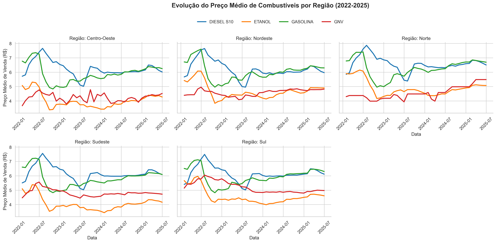
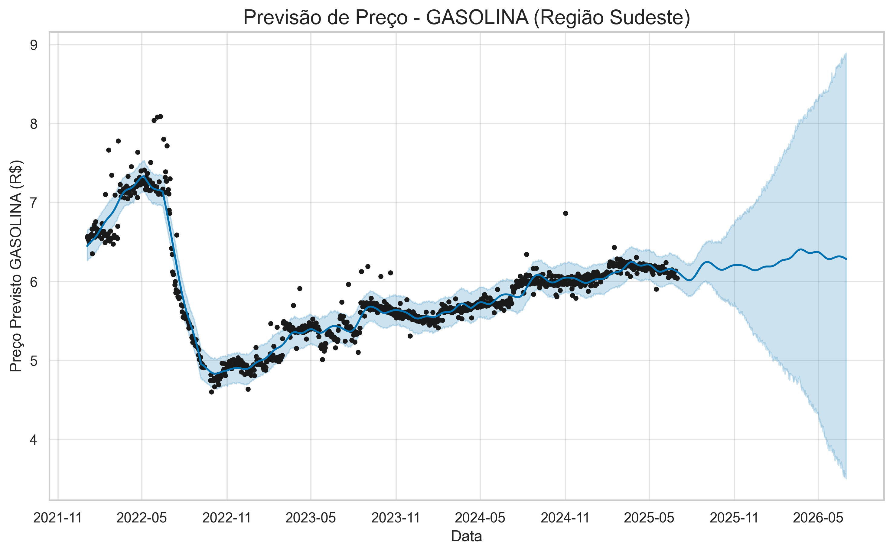
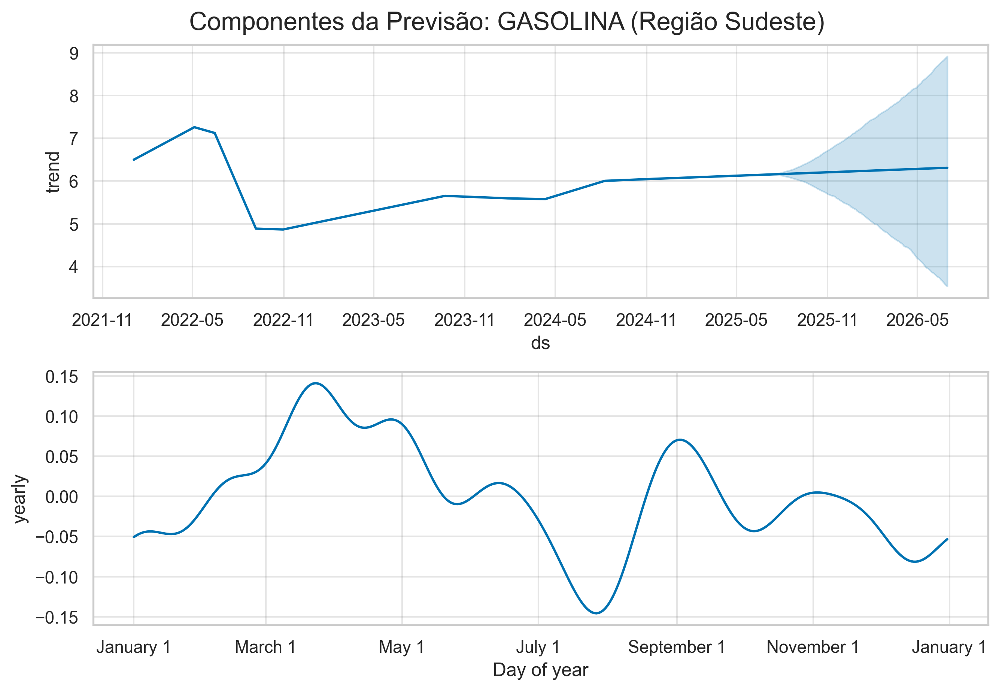

# Projeto Integrador: Análise de Preços de Combustíveis no Brasil (2022-2025)

Este projeto foi desenvolvido como requisito avaliativo para o 6º período do curso de Ciência de Dados e IA. O objetivo é realizar uma análise descritiva e preditiva sobre a série histórica de preços de combustíveis da ANP no Brasil.

O notebook principal (`analise_combustiveis.ipynb`) realiza um pipeline completo de ETL, análise exploratória (EDA) e modelagem de série temporal.

---

## 🎯 Objetivos do Projeto

1. **Análise Histórica:** Analisar e comparar a evolução dos preços médios de Gasolina, Etanol, Diesel S10 e GNV entre as cinco regiões do Brasil (2022-2025).
2. **Análise Preditiva:** Aplicar um modelo de forecasting (Facebook Prophet) para prever a tendência de preço da gasolina na Região Sudeste para os próximos 12 meses (2 semestres).

---

## 🛠️ Ferramentas e Bibliotecas

* Python 3.x
* Pandas (Para ETL e manipulação de dados)
* Seaborn & Matplotlib (Para visualização de dados históricos)
* Prophet (Para modelagem preditiva e forecasting)
* Jupyter Notebook (Executado via VSCode)

---

## 📁 Estrutura do Projeto

A estrutura de diretórios foi organizada para garantir a reprodutibilidade, separando dados, código e resultados:

```
PROJETO-INTEGRADOR-COMBUSTIVEIS/
├── .venv/                  # Ambiente virtual isolado
├── DADOS/                  # Dados brutos .csv da ANP (ignorados pelo .gitignore)
├── imagens/                # Gráficos e visualizações geradas pelo notebook
├── notebooks/              # Contém o notebook principal da análise (.ipynb)
├── .gitignore              # Arquivo de configuração do Git
├── LICENSE                 # Licença MIT do projeto
├── README.md               # Esta documentação
└── requirements.txt        # Dependências do projeto
```

---

## 🚀 Como Executar

1. Clone este repositório.
2. Certifique-se de ter o Python 3.10+ instalado.
3. Crie e ative um ambiente virtual:
```bash
    python -m venv .venv
    # Windows
    .\.venv\Scripts\Activate
    # macOS/Linux
    source .venv/bin/activate
```
4. Instale todas as dependências necessárias:
    ```bash
    pip install -r requirements.txt
    ```
5. Baixe os arquivos CSV da fonte de dados e coloque-os na pasta `DADOS/`.
6. Abra e execute o notebook localizado em `notebooks/analise_combustiveis.ipynb`.

---

## 📊 Fonte dos Dados

Os dados utilizados são públicos e foram extraídos do Portal Brasileiro de Dados Abertos, mantidos pela ANP.

* **Fonte:** Agência Nacional do Petróleo, Gás Natural e Biocombustíveis (ANP)
* **Link:** [https://dados.gov.br/dados/conjuntos-dados/serie-historica-de-precos-de-combustiveis-e-de-glp](https://dados.gov.br/dados/conjuntos-dados/serie-historica-de-precos-de-combustiveis-e-de-glp)

---

## 📈 Resultados Principais

Nesta seção, apresentamos as principais visualizações geradas pelo projeto, ilustrando a análise histórica e a previsão de preços.

### Evolução do Preço Médio de Combustíveis por Região

Este gráfico multifacetado mostra a variação do preço médio de venda para os quatro combustíveis analisados em todas as regiões do Brasil ao longo do tempo. Ele destaca eventos significativos, como as quedas abruptas de preço em 2022, e as disparidades regionais.



### Previsão de Preço para Gasolina na Região Sudeste

Esta visualização apresenta a previsão do modelo Prophet para o preço da gasolina na Região Sudeste, incluindo os dados históricos (pontos pretos), a linha de previsão (azul escura) e o intervalo de confiança (área azul clara), que evidencia a incerteza da projeção.



### Componentes da Previsão (Tendência e Sazonalidade)

Este gráfico detalha os componentes subjacentes da previsão do Prophet. O painel superior exibe a tendência de longo prazo (`trend`), enquanto o inferior mostra o padrão de sazonalidade anual (`yearly`), revelando como esses elementos contribuem para a projeção final de preços.



---

**Análise Histórica:** A análise dos dados de 2022 a 2025 revelou uma forte queda nos preços em meados de 2022 (devido a mudanças na legislação do ICMS) e uma disparidade regional clara, com a Região Norte apresentando custos consistentemente mais altos devido a fatores logísticos.

**Previsão:** O modelo Prophet prevê uma **tendência de leve alta contínua** para a gasolina no Sudeste, extrapolando a recuperação gradual observada desde o final de 2022. No entanto, o principal insight do modelo é o **alargamento drástico do intervalo de confiança** no período previsto. Isso demonstra matematicamente que, devido à alta instabilidade histórica (choques políticos e fiscais) e à dependência de fatores externos (câmbio, petróleo internacional), previsões de longo prazo para este mercado possuem **elevada incerteza estatística**.